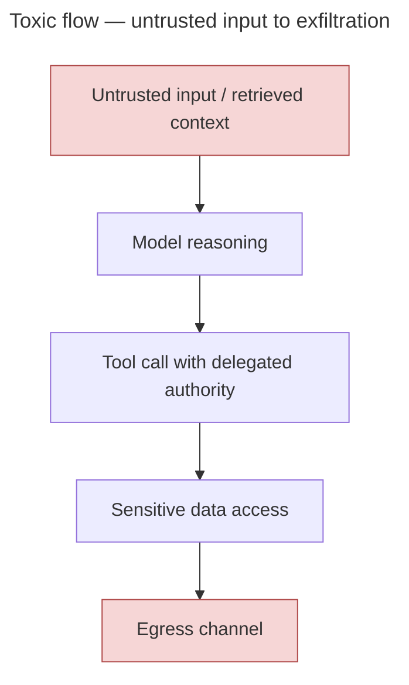

# Agent Assurance in Regulated Financial Services — Overview

**Bottom line.** A first-pass engagement gives your institution nine supervisor-engageable artifacts — drafted in two to four weeks — that answer, with evidence, whether an autonomous agent can let untrusted input reach sensitive data and an egress channel. The problem they address: an agent is not a model, and the gap between them is where the real risk lives — in the composition.

## What your institution walks away with

A first-pass draft of nine artifacts, each structured for second-line and supervisory dialogue without translation work:

- **Agent inventory and tool-authority map** — what your agents can call, and what authority each exercises.
- **Deployment specification** — architecture plus principal model, per deployment.
- **Threat register** — OWASP ASI categories plus five cross-cutting patterns, with severity classification.
- **Toxic-flow analysis** of the authorised tool inventory — compositional paths from untrusted input through privileged data to egress.
- **Gap analysis** against the v1.0 control matrix.
- **Findings** — engagement-style, anchored to regulatory and standards references.
- **Residual-risk acceptance** — signed off by an accountable executive.
- **Evidence-capture inventory** — what is captured at the moment the agent acts, and what is not.
- **Consolidated supervisor-engageable repository** — the eight above, retrievable in one place.

These are **assurance-ready evidence** for your team and your auditors to use in their own work — not attestation, certification, or rating.

## Why it is needed

An autonomous agent is a *runtime system* — model reasoning plus retrieved context, tools, delegated authority, memory, and egress. Model risk management, AI governance, and cybersecurity each govern part of it. Each is necessary. None is sufficient. No single second-line function currently owns the composition, which is where the risk lives — inside fully-authorised workflows.

EchoLeak (CVE-2025-32711, June 2025) is the reference case: Microsoft 365 Copilot read an attacker's email, followed an embedded instruction, retrieved enterprise data through authorised tools, and exfiltrated it through legitimate egress. Zero-click. No single control failure explains it. The composition was the vulnerability.

Run that path against your own deployment. If no one can trace it end to end, you have the gap.

## The methodology, briefly

Five design principles — **evidence-first, framework-anchored, regulator-legible, composable-and-continuous, principal-bound** — anchored to the stack you already operate under (DORA, EU AI Act, ISO/IEC 42001, NIST AI RMF, OWASP Top 10 for Agentic Applications, GDPR). Operationalised through a v1.0 control matrix: 26 controls across 13 families, mapping all ten OWASP ASI categories (ASI05, code execution, is an acknowledged gap) and five cross-cutting threat patterns — tool poisoning, identity-and-privilege abuse, the lethal trifecta, toxic flows, zero-click exfiltration.

## Honest framing

The methodology is preliminary — v1.0 of an artifact that will revise as it meets engagement reality. It has been through three rounds of structured self-review by the author and four rounds of source verification. **This is self-review, not peer review.** External review is the explicit v0.9 milestone, not yet reached. **EU-first, not EU-only:** the architectural argument is cross-jurisdictional; the operational specs are EU-calibrated.

## Start here

In increasing depth: **briefing note** (`briefing/briefing_note.md`) → **Minimum Viable Assurance** (`MINIMUM_VIABLE_ASSURANCE.md`, the 10-of-26 first-pass control subset) → **assurance kit** (`assurance_kit/`, nine templates) → **control matrix** (`paper/control_matrix.md`) → **full paper** (`paper/full.md`, ~27,000 words). Worked examples: the EchoLeak case study (`case_studies/echoleak.md`, retrospective against a real incident) and `reference_application/` (prospective against a hypothetical insurance claims deployment).

---

Fengze Zhong — independent researcher; previously NYU Center for Data Science (not NYU-endorsed). CC BY 4.0; DOI-archived per release on Zenodo (latest: [10.5281/zenodo.20389967](https://doi.org/10.5281/zenodo.20389967), v0.8.28). Repository: [github.com/zhongnz/agent_assurance](https://github.com/zhongnz/agent_assurance) · Briefing: [agentassurance.substack.com](https://agentassurance.substack.com). Engagement channels in `CONTRIBUTING.md`.
